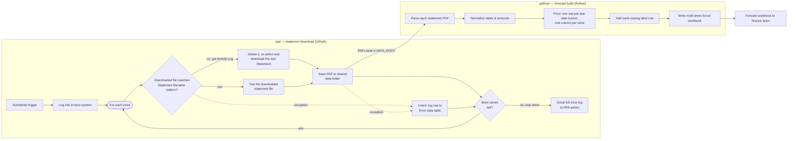

# AP Forecast Pipeline

A two-stage automation pipeline that replaced a weekly manual accounts-payable
forecasting process for a multi-site retail business: an RPA bot downloads
supplier bank statements, and a Python service parses them into a
forecast workbook the finance team can act on immediately.

This is a sanitized, portfolio version of a private production system.
Company name, real store codes, real bank names, real supplier names, and
internal contact details have all been replaced with placeholders — see
[SANITIZATION.md](SANITIZATION.md) for exactly what changed. The
architecture, logic, and code structure are otherwise unmodified.

## The problem

Every week, someone on the finance team had to:

1. Open every supplier's statement PDF, for every store.
2. Read off the overdue balance, broken out by due-date bucket.
3. Retype all of it into a spreadsheet, arranged by store and by which
   bank account the payment run for that store goes through.

For a business with dozens of stores and multiple suppliers, that's a
recurring, error-prone, multi-hour task that has to happen on the same
day every week before the forecast can go out.

## The pipeline



- **`rpa/`** — a UiPath project that logs into the suppliers' invoice
  system on a schedule and downloads each store's newest statement. The
  portal lists the real statement and its "Account Activity Listing"
  under the same name, so the robot can't tell them apart before
  clicking download — after downloading, it checks the file's name
  against the expected pattern, and if it grabbed the Activity Listing
  by mistake, deletes it and re-selects the real statement. Each store
  runs inside a try/catch, saving the statement to a shared folder using
  a fixed filename convention (`{date}_{supplier}_{store}.pdf`) that the
  Python side depends on. A failure on one store is logged and the loop
  moves on to the next store rather than stopping the run; the
  accumulated error log is emailed to the RPA admin once every store has
  been processed. See [`rpa/README.md`](rpa/README.md) for the full
  design decisions.
- **`python/`** — parses those PDFs with `pdfplumber`, normalizes and
  pivots the data with `pandas`, and writes a ready-to-forward Excel
  workbook with `xlsxwriter`. See [`python/README.md`](python/README.md).

The filename convention is the integration contract between the two
stages: the RPA bot names files consistently, and the Python side reads
that name apart (supplier code, store code) instead of needing any
shared database or message queue between them.

## Why this split

RPA and a Python script solve different halves of this problem, and
neither one is a good tool for the other's half:

- The statement portal is a web app behind SSO with no public API for
  this account tier — RPA (UI automation) is the practical way to pull
  files out of it on a schedule, unattended.
- Once the files exist on disk, this is a text-extraction and
  data-reshaping problem — ordinary Python code is far easier to test,
  version, and reason about than trying to do PDF parsing and pandas-style
  pivoting inside a UiPath workflow.

Splitting them at "a folder of PDFs" keeps each side simple and lets
each stage fail, retry, and be re-run independently.

## Outcome

Turned a manual, multi-hour, once-a-week task (open every statement,
read off the overdue balance, retype it into a spreadsheet — for every
store, every supplier) into an unattended pipeline: the RPA bot drops
statements into a folder, and running one script produces the finance
team's forecast workbook.

## Tech stack

| Stage | Tools |
|---|---|
| Statement download | UiPath Studio, UI Automation, Outlook mail activities |
| PDF parsing | Python, `pdfplumber` |
| Data reshaping | `pandas` |
| Workbook export | `xlsxwriter` |
| Config | `python-dotenv`, dataclasses |
| Tests | `pytest` |

## Running the Python side locally

See [`python/README.md`](python/README.md) — it includes a script that
generates synthetic sample statement PDFs, so the whole pipeline runs
end-to-end with no real data required.

## Repo layout

```
ap-forecast-pipeline/
├── rpa/
│   ├── acme-statement-download/       # UiPath project — sample supplier "Acme"
│   ├── northwind-statement-download/  # UiPath project — sample supplier "Northwind"
│   └── README.md
├── python/
│   ├── src/ap_forecast_automation/
│   ├── scripts/
│   ├── tests/
│   └── README.md
└── SANITIZATION.md
```
